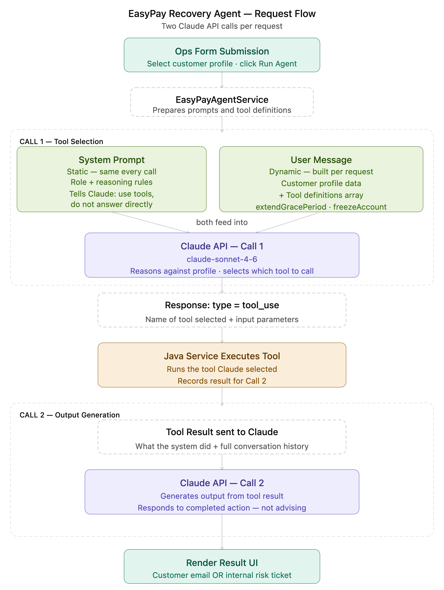
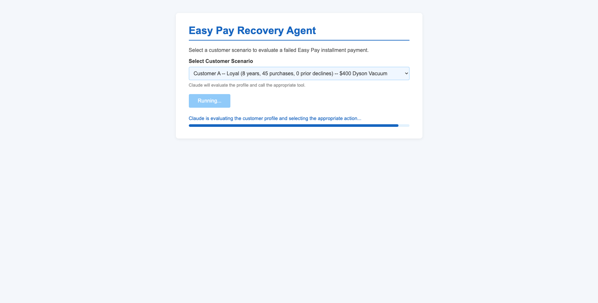
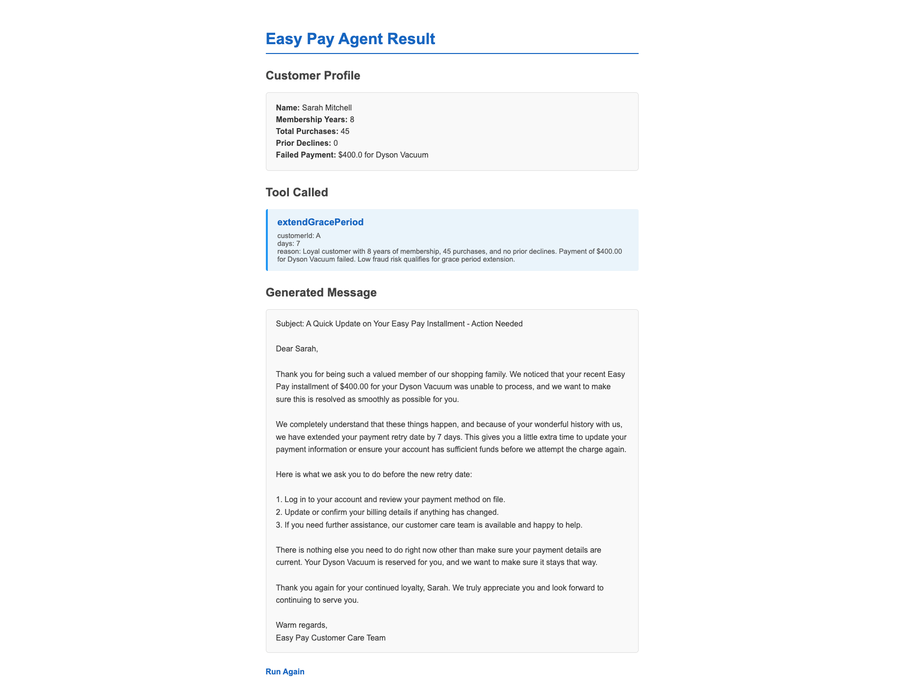

# Easy Pay Recovery Agent

An AI-powered agentic workflow built with Spring Boot and Claude (Anthropic API) that evaluates failed Easy Pay installment payments and autonomously selects the appropriate recovery action using Claude tool calling.

## Live Demo

Primary (Railway - always on, fastest response):
https://easypay-agent-production.up.railway.app/easypay-agent

## Architecture Diagram



## What It Does

Select a customer scenario and the agent autonomously evaluates the customer profile,
reasons about the risk level, and calls the appropriate tool to trigger a recovery action:

- **Tool Called**: extendGracePeriod or freezeAccount -- selected by Claude, not hardcoded
- **Tool Parameters**: customerId, days, reason -- populated by Claude based on the profile
- **Generated Message**: a customer-facing email or internal fraud risk ticket, depending on the action taken

## Customer Scenarios

| Customer | Profile | Expected Action |
|----------|---------|----------------|
| A | 8 years, 45 purchases, 0 declines -- $400 Dyson Vacuum | extendGracePeriod |
| B | 0 years, 3 purchases, 2 declines -- $1,200 MacBook Pro | freezeAccount |
| C | 2 years, 10 purchases, 1 decline -- $250 KitchenAid Mixer | Claude decides |
| D | 15 years, 120 purchases, 0 declines -- $800 Samsung TV | extendGracePeriod |
| E | 0 years, 2 purchases, 1 decline -- $1,500 Diamond Bracelet | Claude decides |

## How It Works

```
User selects customer scenario
        ↓
EasyPayAgentController receives request
        ↓
EasyPayAgentService loads system prompt + tool definitions from resources/
        ↓
First API call: Claude evaluates customer profile and returns a tool_use block
        ↓
Service reads tool name + parameters from tool_use block
        ↓
Service executes the tool locally (extendGracePeriod or freezeAccount)
        ↓
Second API call: Claude receives tool result and generates the final message
        ↓
Report rendered: Customer Profile + Tool Called + Parameters + Generated Message
```

## What Makes This Different From a Standard Prompt

In a standard prompt-based agent, Claude returns text and a human decides what to do.

In this agent, Claude returns a `tool_use` block specifying:
- Which function to call (`extendGracePeriod` or `freezeAccount`)
- What parameters to pass (`customerId`, `days`, `reason`)

Your Java service reads that block and executes the corresponding method. Claude is not
generating text -- it is driving application behavior. That is the architectural difference
between an AI assistant and an AI agent.

## Tool Calling Architecture

Tool definitions live in `src/main/resources/tools/easypay-tools.json` as JSON schemas:

```json
{
  "name": "extendGracePeriod",
  "description": "Extends the Easy Pay retry date for a loyal customer with low fraud risk.",
  "input_schema": {
    "type": "object",
    "properties": {
      "customerId": { "type": "string" },
      "days": { "type": "integer" },
      "reason": { "type": "string" }
    },
    "required": ["customerId", "days", "reason"]
  }
}
```

Claude reads the schema descriptions and matches them to the customer profile at runtime.
The routing logic is never hardcoded -- Claude reasons to it.

## Two-Call API Pattern

**Call 1:** Send customer profile + tool definitions. Claude returns a `tool_use` block.

**Call 2:** Send the full conversation history including the `tool_use` block and the
`tool_result` from local execution. Claude generates the final customer or internal message.

This is the standard Anthropic tool use pattern. The two-call structure ensures Claude
has full context of what the tool actually did before generating the output.

## Prompt Engineering Design

- System prompt is externalized to `src/main/resources/prompts/easypay-system.txt`
  so analysis logic can be updated without a code change
- Tool definitions are externalized to `src/main/resources/tools/easypay-tools.json`
  so tools can be added or modified without touching Java code
- System prompt instructs Claude to call exactly one tool per evaluation
- Plain text output enforced -- no markdown, no emojis

## Tech Stack

- Java 17
- Spring Boot 3.5
- Thymeleaf
- Anthropic Claude API (claude-sonnet-4-6)
- JDK 17 HttpClient (no extra dependencies)
- Railway (hosting)

## Local Setup

1. Clone the repo
2. Set environment variable: `ANTHROPIC_API_KEY=sk-ant-...`
3. Run: `./mvnw spring-boot:run`
4. Open: `http://localhost:8081/easypay-agent`

## Screenshots

### Input Form


### Easy Pay Agent Result


## Project Structure

```
src/main/java/com/shruti/easypay_agent/
├── client/
│   └── AnthropicClient.java        # Raw JDK HttpClient for Anthropic API calls
├── controller/
│   └── EasyPayAgentController.java # GET form, POST evaluate
├── model/
│   ├── Customer.java               # Customer profile
│   └── EasyPayReport.java          # Tool result + generated message
├── repository/
│   └── CustomerRepository.java     # Mock customer data (5 scenarios)
└── service/
    └── EasyPayAgentService.java    # Two-call tool use orchestration

src/main/resources/
├── prompts/
│   └── easypay-system.txt          # System prompt
├── tools/
│   └── easypay-tools.json          # Tool definitions with JSON schemas
└── templates/
    ├── easypay-form.html            # Input form with progress bar
    └── easypay-report.html          # Three-panel result page
```

## Author

Shruti Vargantwar

Senior Software Engineer
